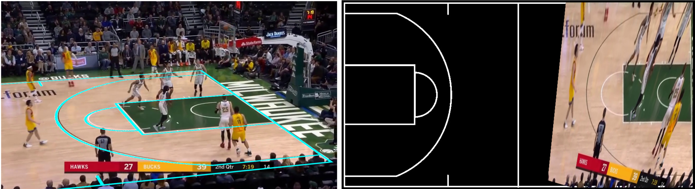
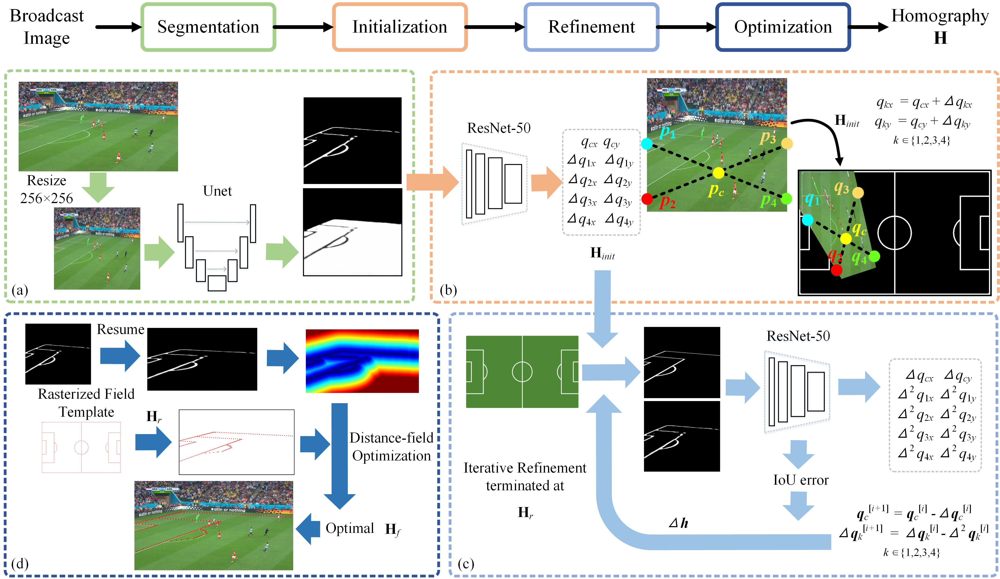

# Accurate Sports Field Registration

This repo holds the code of paper: "Cascaded Framework for Accurate Sports Field Registration on Broadcast Videos".



## Overview

Our method consists of four modules including: a) boundary-aware semantic segmentation for field images under the normal view; b) homography initial prediction via a common neural network; c) homography refinement based on an iterative scheme; d) distance-field optimization scheme to minimize a cost function related to the homography transform. All four modules constitute the cascaded framework.



## Dependencies

* Python >= 3.6
* Pytorch
* CUDA
* OpenCV
* Scipy

## Data setup

1. The NBA 2018 dataset for evaluation can be downloaded [WeiYun](https://share.weiyun.com/eV1Zx84G). This dataset needs to be organized in the following way:
```
|--dataset
|  |--test
|  |  |--img
|  |  |--H
|  |  |--H_mat
|  |  |--mask
|  |--train
|  |  |--img
|  |  |--H
|  |  |--H_mat
|  |  |--mask
|  |--field_nba_new.jpg
```

2. We also provide the model weights which can be obtained [WeiYun](https://share.weiyun.com/SmFCmTEm). These weight files need to be organized in the following way:
```
|--weights
|  |--initH.pth
|  |--refineH.pth
|  |--unet.pth
|  |--resnet50-19c8e357.pth
```

## Demo

Users can run the inference program for a demo image.
```
python inference.py
```
Visual results can be found in ./demo .

## Evaluation

Users can simply run the evaluation program for the NBA 2018 dataset.
```
python evaluation.py
```
Our evaluation result is provided for comparision:
```
iou_part_error_mean:  0.9771360385833909
iou_part_error_median:  0.9792097934382772
iou_part_error_reproj_mean:  0.9750405325450437
iou_part_error_reproj_median:  0.9781856105519158
iou_whole_error_mean:  0.9037344048808611
iou_whole_error_median:  0.9124921804986047
```

## Train

0. Download the NBA 2018 dataset and the pre-trained resnet-50 weight file.

1. Users can train unet segmentation model firstly:
```
python train_unet.py
```
2. Train the homography initialization model:
```
python train_initH.py
```
3. Train the homography refinement model:
```
python train_refineH.py
```

## Create New dataset

We provide a simple homography annotator [here](https://github.com/InfiniZero/homography_annotator) for new dataset creation.


